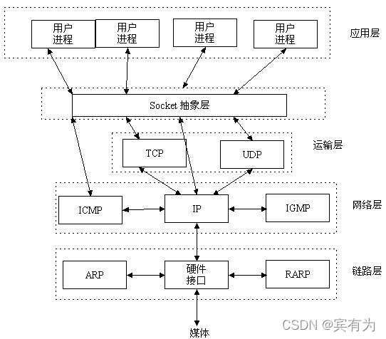
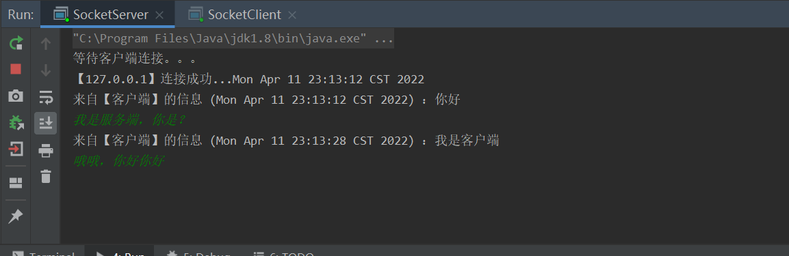
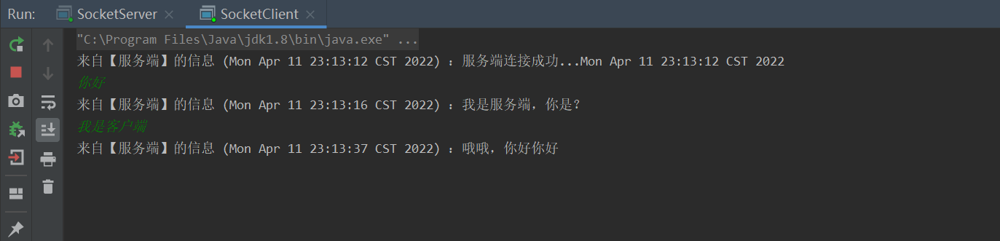
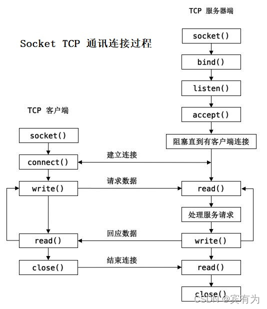

# 一 关于Socket

## 1.1 简介

Socket，又称套接字，在TCP/IP协议分层架构中，属应用层和传输层之间的一个抽象层(也有的说是属于传输层)，它把TCP/IP层复杂的操作抽象为几个简单的接口供应用层调用以实现进程在网络中通信。



## 1.2 优点

1. 传输数据时间短，性能高
2. 可以加密，数据安全性强
3. 适合客户端和服务器端之间信息实时交互
4. 传输数据为字节级，传输数据可自定义，数据量小

## 1.3 缺点

相对于http协议传输，增加了开发量

# 二 效果图展示





# 三 通讯连接过程（源码解析）



## 3.1 服务端

1. **创建Socket，bind()绑定地址，listen()监听套接字**

   > ServerSocket只需要一行代码就可以完成创建、绑定、监听Socket，绑定的地址没填默认就是本机的ip(在源码中InetAddress.anyLocalAddress()方法得出的结论)，监听Socket监听的是改Socket的最大连接数，如果队列满时，会出现提示，并拒绝连接(源码的listen(int backlog)方法这样解释)。

   ```java
   ServerSocket serverSocket = new ServerSocket(端口号);
   ```

2. **accept()监听连接**

   > accept()方法侦听要与ServerSocket建立的连接并接受它。该方法会阻塞，直到建立连接。

   ```
   Socket socket = serverSocket.accept();
   ```

3. **read()读数据**

   > accept()方法连接成功，会返回Socket对象，通过这一个对象，我们可以实现与客户端的互动，互动的过程涉及到对Socket的`write`、`read`，还是建议创建一个线程池，在线程中对Socket的`write`、`read`进行操作。

   ```java
           //通过Socket对象获得InputStream和OutputStream
           InputStream in = socket.getInputStream();
           OutputStream out = socket.getOutputStream();
           // 借助于 InputStream 和 OutputStream 获得 BufferedReader 和 BufferedWriter
           InputStreamReader isr = new InputStreamReader(in);
           BufferedReader reader = new BufferedReader(isr);
           OutputStreamWriter osw = new OutputStreamWriter(out);
           BufferedWriter writer = new BufferedWriter(osw);
   
           while (true) {
               // 接收来自客户端的信息
               System.out.println(reader.readLine());
               // 通过控制台输入信息并且进行发送
               writer.write(input.next());
               writer.newLine();
               writer.flush();
           }
   ```

   在上面的代码中，使用while开启一个死循环，这时候可千万不要理解为这串代码一直在执行着while循环，readLine()方法里，有一个地方会执行到一个read(char cbuf[], int off, int len)方法，源码是这样介绍这个方法的：

   > Reads characters into a portion of an array. This method will block until some input is available, an I/O error occurs, or the end of the stream is reached
   > 将字符读入数组的一部分。此方法将阻塞，直到某些输入可用、发生 IO 错误或到达流末尾

   因此，`readLine()`没有接收到字符，会被`readLine()`方法里面的`read(char cbuf[], int off, int len)`方法阻塞，直到接收到字符，继续往下执行，执行完，重新开始`while`循环。

4. **write()写数据**

   `flush()`方法才可实现推送消息给客户端。

   ```java
   // 通过控制台输入信息并且进行发送
   writer.write(input.next());
   writer.newLine();
   //强制把数据输出,清空缓冲区
   writer.flush();
   ```

5. **close()关闭连接**

   关闭连接，也要顺带把与用户的Socket连接也给关闭掉

   ```java
   // 方法一：
   socket.close(); // 关闭指定客户端的连接
   reader.close(); // 关闭阅读器
   server.close(); // 关闭ServerSocket
   // 方法二：
   // 接收客户端的消息，如果消息为约定好的断开连接的消息，则断开连接
   ```

## 3.2 客户端

1. **创建Socket、connect()连接Socket**

   客户端创建Socket，`new Socket(String host, int port);`需要抛出异常，当IP地址错误、端口号错误、服务器`ServerSocket`未启动时，都会抛出异常，即连接失败。

   ```java
   try {
   	Socket socket = new Socket(String host, int port);
   } catch (Exception e) {
       e.printStackTrace();
   }
   ```

2. **write()写数据**

   > 同服务端

3. **read()读数据**

   > 同服务端

4. **close()关闭连接**

   ```java
   // 方法一：
   socket.close();
   // 方法二：
   // 给服务器发送相关消息，由服务器断开与指定客户端的连接
   ```

   
